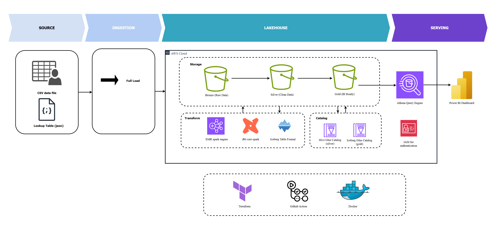
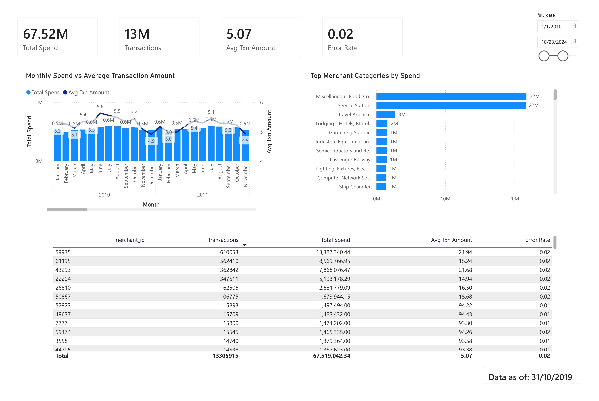
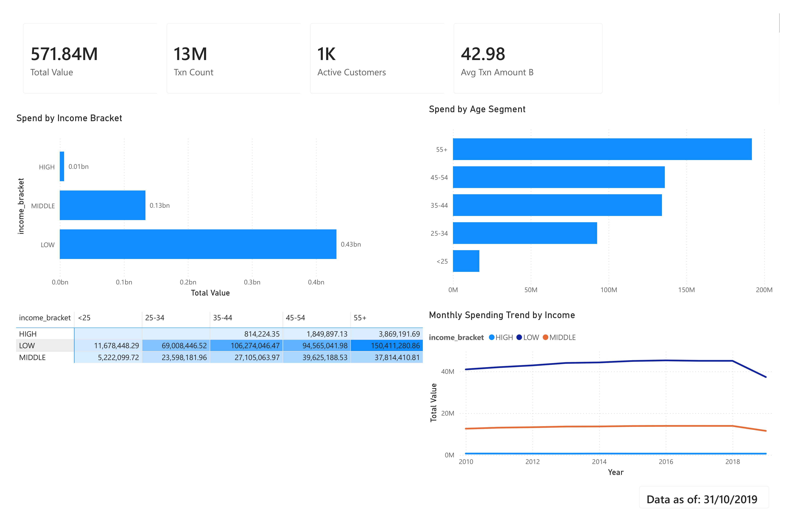
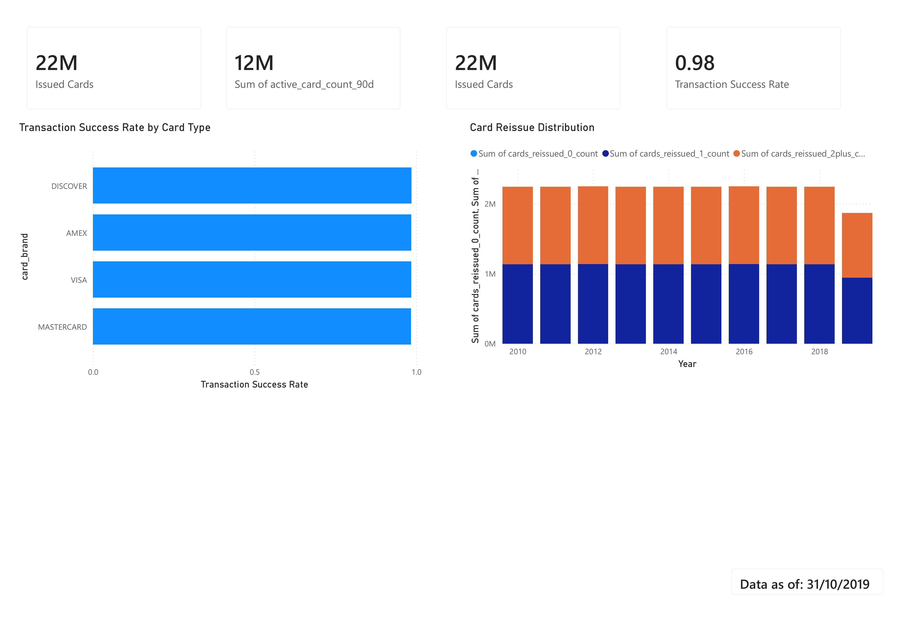

# Retail Banking Analytics Platform — AWS Batch Data Pipeline

A batch data platform for retail banking analytics, built on **AWS EMR Serverless**, **PySpark**, **dbt** and **Apache Iceberg**, following the Medallion Architecture (Bronze → Silver → Gold). The Gold layer is a dimensional model (star schema) plus a SQL reporting layer that materializes every business metric, so BI tools only ever `SELECT` — they never re-implement a formula.

The platform runs on a **synthetic** dataset and is a portfolio project. The business context (a Marketing / Segment Manager planning card promotions and cashback partnerships) is documented as a real specification and drives every modeling decision — see [docs/bussiness_requiment/Retail Banking Analytics Platform.md](docs/bussiness_requiment/Retail%20Banking%20Analytics%20Platform.md).

---

## Architecture



| Layer | Engine | Format | Catalog | Purpose |
|---|---|---|---|---|
| **Bronze** | — | CSV / JSON | — | Raw landed files, immutable |
| **Silver** | PySpark (EMR Serverless) | Parquet | `finance_silver` *(Glue Crawler, temporary)* | Cleaned, typed, deduplicated, audited |
| **Quarantine** | PySpark | Parquet | — | Records rejected by mandatory-column or dedup audits |
| **Gold — staging** | dbt + Spark | Iceberg | `gold_staging` | `stg_*` models, SCD2 snapshots, `us_holidays` seed |
| **Gold — marts** | dbt + Spark | Iceberg | `gold` | Dimensions, facts, bridge, factless fact |
| **Gold — reporting** | dbt + Spark | Iceberg | `gold` | `rpt_*` models — the metrics layer |
| **Serving** | Athena | — | `gold` | Power BI reads the Gold Iceberg tables through an Athena workgroup |

**Stack:** AWS EMR Serverless 7.13 (custom ECR image, Python 3.12) · PySpark 3.5 · dbt-spark 1.11 (`session` method over Spark Connect) · Apache Iceberg on Glue Data Catalog · S3 · Athena · Terraform · GitHub Actions

---

## Dashboards

### Dashboard A — Merchant & Category Spending (flagship)


### Dashboard B — Customer Spending by Segment


### Dashboard C — Card Portfolio


| Dashboard | Question it answers | Reads from |
|---|---|---|
| **A — Merchant & Category Spending** *(flagship)* | Where do customers spend, and which merchant categories are good cashback partners? | `fact_daily_transaction_trend`, `rpt_merchant_error_daily` |
| **B — Customer Spending by Segment** | Which segments drive value, and how is that shifting — using attributes **as they were** in each period? | `fact_transactions`, `fact_customer_activity_daily`, `fact_user_monthly_snapshot` |
| **C — Card Portfolio** | Issued vs. active cards, chip adoption, reissue frequency, success rate by card type | `rpt_card_portfolio` |

---

## Data Source

A public **synthetic** credit-card transaction dataset (Kaggle, derived from IBM's synthetic transaction data) — four files landed into `bronze/`:

| Dataset | Source file | Write mode | Notes |
|---|---|---|---|
| `transactions` | `transactions_data.csv` | **append** | Immutable events; partitioned by `year`/`month`/`day` |
| `cards` | `cards_data.csv` | **upsert** | Mutable (expiry, reissue count) → SCD2 downstream |
| `users` | `users_data.csv` | **upsert** | Mutable (address, income) → SCD2 downstream |
| `mcc` | `mcc_codes.json` | **overwrite** | Reference table, replaced in full each run |

**The source is static, and that matters.** Data spans `2010-01-01` → `2019-10-31`, and each customer/card has exactly one version. Two consequences are load-bearing across the docs: the SCD2 test suite currently passes *vacuously* (there is no second version to get wrong), and the T+1 cadence cannot be demonstrated end to end. Replacing this with a generated event stream is the first Roadmap item.

---

## The Gold Layer

Point-in-time correctness is the design centre. `fact_transactions` resolves `customer_key` / `card_key` through an **as-of range join** on the dimension validity interval `[effective_from_date, effective_to_date)` — a past transaction carries the attributes valid *at its own timestamp*, never today's. Surrogate keys are MD5 hashes (scales on Spark, no sequences).

| Model | Grain | Materialization |
|---|---|---|
| [`dim_customers`](dbt/models/marts/dim_customers.sql) | customer × validity interval (SCD2) | incremental `merge` |
| [`dim_cards`](dbt/models/marts/dim_cards.sql) | card × validity interval (SCD2) | incremental `merge` |
| [`dim_dates`](dbt/models/marts/dim_dates.sql) · [`dim_times`](dbt/models/marts/dim_times.sql) | day (2010–2035, US holidays) · second of day | table |
| [`dim_geo`](dbt/models/marts/dim_geo.sql) · [`dim_merchant`](dbt/models/marts/dim_merchant.sql) | location · MCC category (Type 1) | table |
| [`fact_transactions`](dbt/models/marts/fact_transactions.sql) | one transaction | incremental `merge`, partitioned by `date_key` |
| [`fact_daily_transaction_trend`](dbt/models/marts/fact_daily_transaction_trend.sql) | day × mcc × merchant | incremental `insert_overwrite` |
| [`fact_user_monthly_snapshot`](dbt/models/marts/fact_user_monthly_snapshot.sql) | customer × month | incremental `insert_overwrite` |
| [`trans_error_bridge`](dbt/models/marts/trans_error_bridge.sql) · [`card_owner_factless`](dbt/models/marts/card_owner_factless.sql) | transaction × error code · card ↔ owner | incremental `append` · table |

### Metrics layer

Metric definitions live in **[dbt/models/marts/reporting/](dbt/models/marts/reporting/)** as plain SQL models, not in a semantic layer: dbt's MetricFlow does not support the `dbt-spark` adapter, so a thin reporting layer is the equivalent pragmatic choice on this stack. Every model there carries a `.yml` with the metric definition *and* the aggregation rules that make it wrong if ignored.

| Model | Materializes |
|---|---|
| [`fact_customer_activity_daily`](dbt/models/marts/reporting/fact_customer_activity_daily.sql) | Active Customer / Active Card (trailing 90 days) |
| [`rpt_card_portfolio`](dbt/models/marts/reporting/rpt_card_portfolio.sql) | Chip Adoption Rate, issued vs. active cards, reissue distribution, success rate by card type |
| [`rpt_merchant_error_daily`](dbt/models/marts/reporting/rpt_merchant_error_daily.sql) | Abnormal Error Rate (merchant) — trailing 30 days, calibrated thresholds |

Ratios are never stored where a table is meant to be rolled up — only counts are, and the ratio is recomputed at the grain being read. The full registry, materialization homes and the ten aggregation rules are in [docs/metrics/metrics_layer.md](docs/metrics/metrics_layer.md) *(Vietnamese)*.

### Testing

24 singular tests in [dbt/tests/](dbt/tests/) plus schema tests, weighted towards the failures that silently produce wrong numbers rather than towards column-level trivia: SCD2 interval overlap and coverage, current-version uniqueness, referential integrity for the bridge and factless fact, and **reconciliation tests** that recompute each aggregate from `fact_transactions` and require an exact match. `rpt_card_portfolio` additionally cross-checks Active Card against `fact_customer_activity_daily` — the one metric deliberately materialized in two places.

---

## Infrastructure

Terraform with a remote S3 backend, four stacks applied in order:

| Stack | Provisions |
|---|---|
| [terraform/bootstrap/](terraform/bootstrap/) | State bucket (versioned, encrypted, `prevent_destroy`) |
| [terraform/environments/dev/platform/](terraform/environments/dev/platform/) | Data lake bucket (`bronze/ silver/ gold/ gold/iceberg/ quarantine/`), code bucket, ECR repo, GitHub Actions OIDC role |
| [terraform/environments/dev/compute/](terraform/environments/dev/compute/) | EMR Serverless application (custom image, interactive sessions), Glue databases `gold` / `gold_staging`, execution role |
| [terraform/environments/dev/serving/](terraform/environments/dev/serving/) | Athena workgroup `power-bi-dev` + query-results bucket |

A few grants sit **outside** Terraform on purpose — the Glue `default` scratch database Spark probes at boot, and read access to the crawler-created `finance_silver`. The reasoning and lifecycle of each is in [scripts/gold-dbt/README.md](scripts/gold-dbt/README.md) §4.

---

## Quickstart

**Prerequisites:** Python ≥ 3.11 + Poetry · AWS CLI configured · Terraform · `gh` CLI · a dbt profile named `aws_pipeline` in `~/.dbt/profiles.yml` (`type: spark`, `method: session`, reading `SPARK_REMOTE`)

```bash
# 1. Remote state backend (once per account)
cd terraform/bootstrap && terraform init && terraform apply

# 2. Platform + compute infra, seed bronze, build & push the Spark image,
#    then write scripts/.env.runtime from the Terraform outputs
bash scripts/_setup_infra.sh

# 3. Bronze → Silver on EMR Serverless
bash scripts/deploy_silver_job_dev.sh

# 4. Expose Silver to dbt (temporary — goes away once Silver moves to Iceberg)
bash scripts/gold-dbt/glue_crawler.sh

# 5. Silver → Gold with dbt. Read the runbook FIRST: every dbt command in the
#    script is commented out by default and meant to be run one block at a time.
bash scripts/gold-dbt/deploy_gold_dbt_dev.sh
```

Step 5 is where the operational depth is — model ordering constraints, `batch_logical_date` semantics (it means the **data** date, not the run date), the cleanup trap that guarantees no interactive session is left burning money, and a run history. All of it: [scripts/gold-dbt/README.md](scripts/gold-dbt/README.md) *(Vietnamese)*.

Serving is applied separately: `cd terraform/environments/dev/serving && terraform init && terraform apply`.

---

## Documentation

The specifications are the primary artifact of this project; the code is downstream of them. Each spec carries document control, a changelog and a decision log.

| Area | Documents |
|---|---|
| **Business specification** | [Retail Banking Analytics Platform](docs/bussiness_requiment/Retail%20Banking%20Analytics%20Platform.md) — persona, metric definitions, dashboards, success criteria |
| **Metrics** | [metrics_layer.md](docs/metrics/metrics_layer.md) (registry + aggregation rules), [card_portfolio_report.md](docs/metrics/card_portfolio_report.md), [merchant_error_daily_report.md](docs/metrics/merchant_error_daily_report.md), [abnormal_error_rate_calibration.md](docs/metrics/abnormal_error_rate_calibration.md) |
| **Dimensions** | [customers](docs/dimensions/customers_dimension.md), [cards](docs/dimensions/cards_dimension.md), [dates](docs/dimensions/dates_dimension.md), [time](docs/dimensions/time_dimension.md), [geo](docs/dimensions/geomentrics_dimension.md), [merchant categories](docs/dimensions/merchant_categories_dimension.md) |
| **Facts & helpers** | [transactions](docs/facts/transactions_fact.md), [daily trend](docs/facts/daily_transaction_trend_fact.md), [customer activity](docs/facts/customer_activity_daily_fact.md), [monthly snapshot](docs/facts/user_monthly_snapshot_fact.md), [error bridge](docs/helpers/transaction_errors_bridge.md), [card owner factless](docs/helpers/card_owner_factless.md) |
| **Known issues** | [dbt-spark relation cache](docs/known_issues/dbt_spark_relation_cache.md) — snapshots dropping SCD2 history on every run; fixed with a macro override, with the static-source limitation still open |
| **Runbook** | [scripts/gold-dbt/README.md](scripts/gold-dbt/README.md) — the Gold dbt deployment step by step, plus a run history |
| **Data contracts** | [src/aws_pipeline/schemas/](src/aws_pipeline/schemas/) — Silver/Gold `StructType` definitions with governance tags |

> Documents under `docs/metrics/`, `docs/known_issues/` and `scripts/gold-dbt/README.md` are written in **Vietnamese**; the business specs, dimension/fact specs and code comments are in English.

---

## Repository Layout

```
AWS-batch-data-pipeline/
├── assets/                        # Dashboard screenshots
├── dbt/
│   ├── models/{source,staging,marts,marts/reporting}/
│   ├── snapshots/                 # SCD2 (check strategy)
│   ├── macros/                    # incl. the dbt-spark relation-cache fix
│   ├── seeds/                     # us_holidays
│   └── tests/                     # 24 singular tests
├── jobs/bronze_to_silver_job.py   # PySpark entry point (EMR Serverless)
├── src/aws_pipeline/
│   ├── transformation/            # Silver: readers, cleaning, audit + write
│   ├── schemas/                   # Data contracts
│   ├── quality/                   # Audit logging, quality config
│   └── utils/
├── scripts/
│   ├── _setup_infra.sh            # One-shot dev bootstrap
│   ├── deploy_silver_job_dev.sh
│   └── gold-dbt/                  # Gold dbt runbook, crawler, SQL probes, IAM policies
├── terraform/{bootstrap,environments/dev/{platform,compute,serving},modules}/
├── docker/Dockerfile              # EMR Serverless custom image
├── docs/                          # Specifications (see above)
└── notebooks/                     # EDA, EMR/dbt connectivity checks
```

---

## Data Governance

- **Timezone** — all timestamps stored in UTC (`TIMESTAMP_NTZ`); conversion to local time happens in BI.
- **Audit columns** on every Silver table: `_created_at`, `_updated_at`, `_processing_id` (Spark application ID), `_source_file`, `_batch_logical_date`, `_is_deleted`.
- **PII** — card numbers are masked to the last 4 digits at Silver; sensitive fields are tagged in the schema definitions.
- **Silver processing pattern** — `audit_mandatory_columns` → transform → `audit_duplicates` → schema enforcement → write, with every rejected record preserved under `quarantine/`, partitioned by source and date.
- **Metric ownership** — a metric has exactly one definition (business spec §4) and one materialization home ([metrics_layer.md](docs/metrics/metrics_layer.md) §2). The single deliberate exception, Active Card, is held together by a mandatory cross-check test.
- **Parameter provenance** — calibrated thresholds live as `dbt_project.yml` vars and are carried onto every row as `applied_*` columns, so historical rows state which parameters produced them. Changing a var does not rewrite history; that takes an explicit `--full-refresh`.

---

## Deprecated / Superseded

Still in the tree, kept for history, **not** the current path:

| Path | Status |
|---|---|
| [src/aws_pipeline/aggregation/](src/aws_pipeline/aggregation/), [jobs/silver_to_gold_job.py](jobs/silver_to_gold_job.py), [scripts/deploy_gold_job_dev.sh](scripts/deploy_gold_job_dev.sh) | The Gold layer as PySpark. Superseded by the dbt project. |
| [src/aws_pipeline/quality/awap_deprecated/](src/aws_pipeline/quality/awap_deprecated/) | Custom Audit-Write-Audit-Publish framework. Superseded by dbt tests + snapshots. |
| [warehouse/](warehouse/) | Redshift DDL. Redshift was dropped in favour of querying the Gold Iceberg tables directly through Athena. |
| [docker-compose.yml](docker-compose.yml) | Local Spark cluster. Superseded by Spark local mode for small tests and EMR Serverless for everything else. |
| [dags/aws_pipeline.py](dags/aws_pipeline.py) | Airflow DAG — a stub only; orchestration is still manual (Roadmap). |
| [docs/bussiness_requiment/Fraud Operations Command Center.md](docs/bussiness_requiment/Fraud%20Operations%20Command%20Center.md) | A specification-writing exercise for a near-real-time domain. Not planned for implementation. |

---

## Roadmap

**Done**
- [x] Bronze → Silver on EMR Serverless (PySpark), with quarantine and audit columns
- [x] Gold migrated from PySpark to **dbt + Iceberg** on the Glue Data Catalog
- [x] SCD2 dimensions with **as-of** point-in-time joins into `fact_transactions`
- [x] Metrics/reporting layer in SQL, with aggregation rules documented per column
- [x] Reconciliation + SCD2 test suite; all Gold models green on dev, incremental branches verified idempotent
- [x] Terraform-managed infrastructure (remote state, four stacks) + GitHub Actions image build to ECR
- [x] Athena workgroup for BI consumers

**Next**
- [ ] **Publish the Power BI dataset** on Athena (DirectQuery), covering Dashboards A/B/C
- [ ] **Replace the static source** with a transactional database and a transaction simulator, so incremental/CDC and T+1 get exercised for real — and the SCD2 tests stop passing vacuously
- [ ] **Migrate Silver to Iceberg**, dropping the temporary Glue Crawler and the `finance_silver` grant with it
- [ ] **Orchestrate with Airflow** — one task group per dataset, `logical_date`-parameterized for backfill, each layer gated on test success
- [ ] **CI/CD** — lint + `dbt build` on pull requests, Terraform `plan` as a PR comment, wheel publish and infra apply on merge
- [ ] **Data quality as a gate**, not a post-hoc check — fail the DAG and alert on violation, instead of surfacing it in a dashboard
